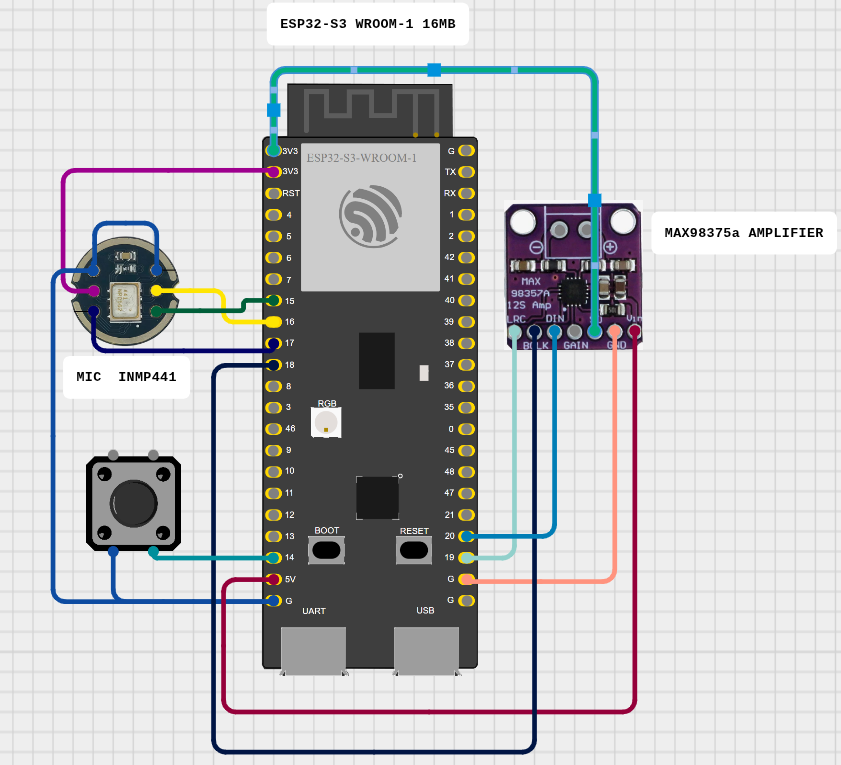

# Virtual Assistant Demo

This project — built as a test for the **Goiaba** platform — demonstrates a **real-time virtual assistant** powered by the **OpenAI Realtime API**, connected via **WebRTC**.

It showcases how to:

* Capture audio from an **INMP441** PDM MEMS microphone via **I²S**
* Encode and stream audio using **Opus** over **WebRTC** directly to OpenAI's Realtime endpoint
* Receive AI-generated responses in real time and play them back through a **MAX98357A** Class-D amplifier

All of this runs on an **ESP32-S3 DevKitC-1**. It starts automatically when the assistant’s voice (from the GPT output) asks something, initiating a real-time, two-way audio exchange.



## Hardware Used

| Item    | Details                                                           |
| ------- | ----------------------------------------------------------------- |
| MCU     | ESP32‑S3 DevKitC‑1 (module **ESP32‑S3‑WROOM‑1‑N16**, 16 MB Flash) |
| Mic     | INMP441 I²S MEMS microphone breakout                              |
| Amp     | MAX98357A I²S 3 W audio amplifier breakout                        |
| LED     | On‑board RGB LED (GPIO38)                                         |

## Wiring

| Function     | ESP32‑S3 GPIO | INMP441 | MAX98357A              | Notes                               |
| ------------ | ------------- | ------- | ---------------------- | ----------------------------------- |
| 3.3 V        | 3V3           | VIN     | VIN                    | Common supply                       |
| GND          | GND           | GND     | GND                    | Common ground                       |
| **BCLK Rx**  | **15**        | SCK     | –                      | Mic bit‑clock                       |
| **WS Rx**    | **16**        | WS/LR   | –                      | Mic word‑select                     |
| **DATA IN**  | **17**        | SD      | –                      | Mic → MCU                           |
| **BCLK Tx**  | **18**        | –       | BCLK                   | Amp bit‑clock                       |
| **WS Tx**    | **19**        | –       | LRC                    | Amp word‑select                     |
| **DATA OUT** | **20**        | –       | DIN                    | MCU → Amp                           |
| L/R Select   | —             | L/R→GND | –                      | Mono (Left)                         |
| Enable (SD)  | —             | –       | SD/EN→3V3              | Amp always on                       |
| Gain         | —             | –       | GAIN→3V3 / GND / float | 12 dB / 6 dB / 9 dB                 |
| LED          | **38**        | –       | –                      | Built‑in LED                        |

### Key Libraries / Headers

* **ESP-IDF HAL** (`driver/i2s.h`) – I²S peripheral access
* `esp_heap_caps.h` – heap-capable SRAM allocation
* **esp-libopus** – audio compression for ESP32 (low-latency streaming over WebRTC)
* **libpeer** – lightweight WebRTC peer connection handling for the ESP32-S3

## Runtime Parameters (default)

- `SAMPLE_RATE` = 16000 Hz

> Using a module **with PSRAM** (e.g. ESP32‑S3‑WROOM‑1‑N8R8) you can raise both values (10 s @ 16 kHz ≈ 320 kB).

## Configuration

In your project root, run `make menuconfig` and navigate to **Component config → ESP PSRAM → Support for external, SPI-RAM** (enable it!). There you’ll find the "PSRAM Type" setting—change it from the default Quad-SPI to **Octo-SPI**. Once enabled, save and exit; the build system will automatically configure the Octo-SPI driver so you can take full advantage of your 8 MB PSRAM for high-bandwidth audio buffering.

Run `idf.py menuconfig` and set:

- **External PSRAM**
  **Component config → ESP32S3-specific**

  - `CONFIG_SPIRAM=y`
  - `CONFIG_SPIRAM_USE_MALLOC=y`

- **Partition table**
  **Partition Table**

  - Select **Custom partition table CSV**
  - `Partition Table Filename` → `partitions.csv`

- **Wi-Fi credentials**
  **Component config → Wi-Fi credentials**

  - `CONFIG_WIFI_CONNECT_SSID` — your network’s SSID
  - `CONFIG_WIFI_CONNECT_PASSWORD` — your network’s password

- **OpenAI configuration**
  **Component config → OpenAI configuration**

  * `OPENAI_REALTIMEAPI` — full URL of the OpenAI Realtime API endpoint (e.g. `https://api.openai.com/v1/realtime?model=gpt-4o-mini-realtime-preview`)
  * `CONFIG_OPENAI_API_KEY` — your OpenAI secret key for authorization (`sk-...`)
  * `CONFIG_OPENAI_MODEL` — the OpenAI model to use for the virtual assistant (default: `gpt-4o-mini-realtime-preview`)
  * `CONFIG_OPENAI_VOICE` — the voice to use for text-to-speech synthesis (default: `coral`)


- **DTLS-SRTP support**
  **Component config → mbedTLS**
  - Enable **Negotiation of DTLS-SRTP (RFC 5764)** (`CONFIG_MBEDTLS_SSL_DTLS_SRTP=y`)

You can pre-populate these in `sdkconfig.defaults`:

````ini
CONFIG_SPIRAM="y"
CONFIG_SPIRAM_USE_MALLOC="y"
CONFIG_PARTITION_TABLE_CUSTOM=y
CONFIG_PARTITION_TABLE_CUSTOM_FILENAME="partitions.csv"

CONFIG_WIFI_CONNECT_SSID="your_ssid"
CONFIG_WIFI_CONNECT_PASSWORD="your_password"
CONFIG_MBEDTLS_SSL_DTLS_SRTP="y"

CONFIG_OPENAI_REALTIMEAPI="https://api.openai.com/v1/realtime?model=gpt-4o-mini-realtime-preview"
CONFIG_OPENAI_API_KEY="sk-xxxxx"
CONFIG_OPENAI_MODEL="gpt-4o-mini-realtime-preview"
CONFIG_OPENAI_VOICE="coral"

## Quick Start

```bash
# 1. (Once) Set up environment
make setup

# 2. Build firmware
make build

# 3. Flash to device
make flash

# 4. Monitor UART (115200 baud)
make monitor
````

Press **Ctrl+]** to exit the serial monitor.

## License

MIT © 2025
